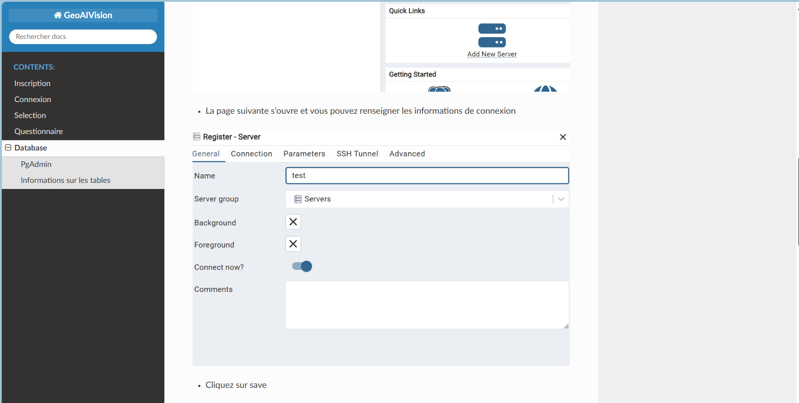
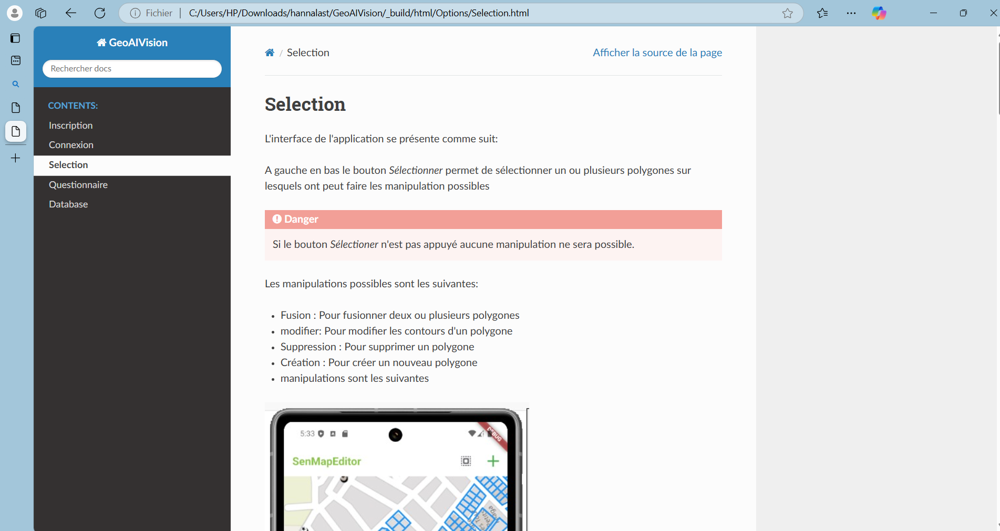
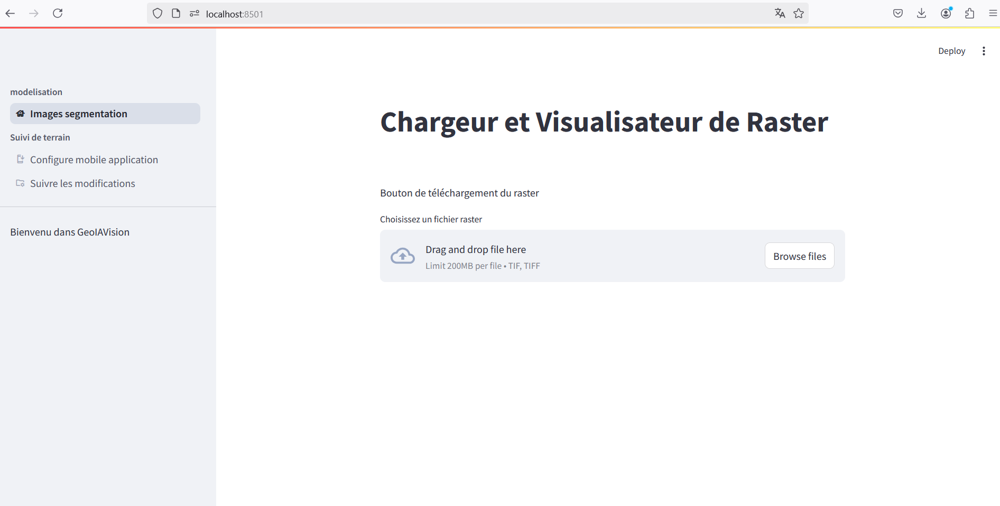

# Application Flutter de Gestion des Polygones
## Note: 
La version la plus aboutie de l'application se trouve dans la branche final_app de ce dépôt GitHub https://github.com/Mafieuu/SenMapEditor/tree/final_app , dans le dossier _finalapp. Elle comporte une page de connexion, un bouton pour se déconnecter, un bouton pour sauvegarder les modifications, ainsi que les fonctionnalités de création et de suppression de polygones. De plus, elle utilise une base de données locale SQLite similaire à celle présente sur AWS, abandonnant les fichiers GeoJSON au profit de SQLite pour faciliter le transfert des données modifiées par l'utilisateur de son appareil mobile vers le cloud.

Malheureusement, cette version comporte un bug qui empêche l'utilisateur de se connecter. Nous tentons de résoudre ce problème, mais en raison des contraintes de temps et des exigences académiques de notre école, nous n'avons pas encore réussi. Par conséquent, nous sommes contraints de nous rabattre sur une version moins sophistiquée de notre application, qui se trouve dans la **branche main** dans le dossier **senmapeditor**.


Nous avons aussi cree une documentation readthedoc accessible depuis le lien :probleme de deploiement,voir https://github.com/Mafieuu/Geo_ia_vision_doc pour plus d'informations


doc_selection

Nous avons aussi deployer une application streamlit accessible depuis : https://geoiavisionwebapp.streamlit.app/



## Description
Cette application Flutter permet d'afficher et de modifier des polygones à partir d'un fichier GeoJSON de Sangalkam. Elle inclut un système d'authentification basé sur un fichier JSON local.

## Fonctionnalités
- Affichage du fichier GeoJSON de Sangalkam.
- Modification des polygones (création, fusion, suppression).
- Système d'authentification (inscription et connexion).
- Enregistrement des informations utilisateur dans un fichier JSON.


## Utilisation
1. Lancez l'application :
   ```bash
   flutter run
   ```
2. À l'ouverture de l'application, l'utilisateur peut se connecter.

   - **Connexion** : Saisir le pseudonyme et le mot de passe pour vérifier les informations dans le fichier JSON.

3. Si la connexion est réussie :
   - Vérifiez localement si le fichier GeoJSON correspondant à la localité de l'utilisateur est présent.
     - Si oui, affichez le fichier et appliquez les modifications, créations et fusions.
     - Si non, proposez de télécharger le fichier depuis AWS. Envoyez le pseudonyme et le mot de passe pour vérification. Si les informations correspondent, téléchargez le fichier GeoJSON.

## TODO
- [ ] Implémenter la fonctionnalité de mise à jour de la base de données via un bouton de mise à jour.
- [ ] Ajouter la gestion des erreurs et des messages d'erreur pour les tentatives de connexion échouées.
- [ ] Optimiser le processus de téléchargement et de vérification des fichiers GeoJSON depuis AWS.
- [ ] Améliorer l'interface utilisateur pour une meilleure expérience utilisateur.
- [ ] Ajouter des tests unitaires et d'intégration pour assurer la fiabilité de l'application.
### Note important 
Dans la branche debug il y'a une version de l'application qui utulise des tuiles et une autre qui implemente un interface user
cependant ma config de java m'empeche de compiler ces applications (qui n'ont pas d'erreur selon le compilateur)

