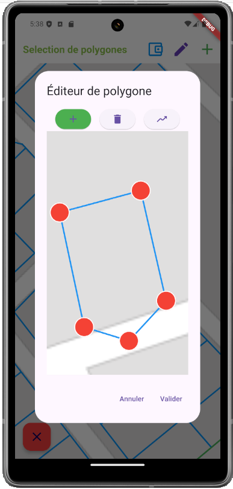
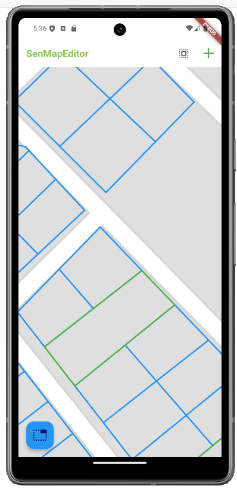
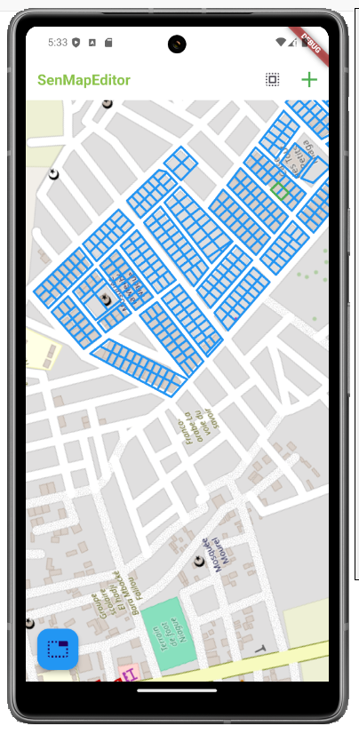

# Application Flutter de Gestion des Polygones

<!-- @import "[TOC]" {cmd="toc" depthFrom=1 depthTo=6 orderedList=false} -->

## Description
Cette application Flutter permet de gérer et de modifier des polygones à partir d'une base de données SQLite, synchronisée avec le cloud. Elle se distingue par des fonctions avancées pour modifier et fusionner des polygones, basées sur des concepts mathématiques solides

## Fonctionnalités

    - Gestion des polygones : Modification et fusion de polygones avec des algorithmes mathématiques fiables.
    - Base de données SQLite : Conversion des fichiers GeoJSON en une base locale SQLite, - - - pouvant être mise à jour depuis le cloud via un bouton Upgrade (...).
   -  Authentification : Page d'identification
   -  Déconnexion : Bouton pour se déconnecter .
   -  Sauvegarde local avec SQLite
    Mise à jour cloud : Synchronisation des données locales avec les dernières mises à jour du cloud (...)

## Utilisation
1. clonnez le repertoire,aller a la branche final_app et dans le dossier _finalApp puis <flutter run>

## TODO
- [ ] Implémenter la fonctionnalité de mise à jour de la base de données via un bouton de mise à jour.
- [ ] Ajouter la gestion des erreurs et des messages d'erreur pour les tentatives de connexion échouées.

- [ ] Ajouter des tests unitaires 
## Note important 
Dans la branche debug il y'a une version de l'application qui utulise des tuiles et une autre qui implemente un interface user
cependant ma config de java m'empeche de compiler ces applications (qui n'ont pas d'erreur selon le compilateur)

La branche final_app[dossier _finalApp] est la version la plus abouti bien que pas encore au point.

