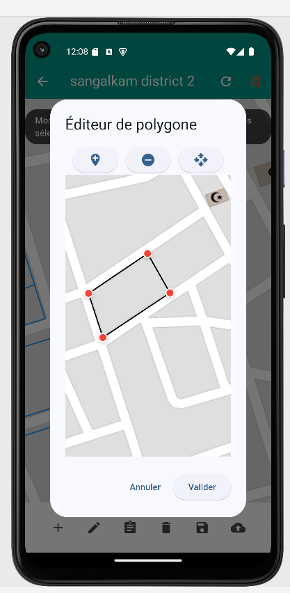

# GeoAIvision: Identification d'Objets Géospatiaux avec IA


GeoAIvision est un projet novateur qui combine intelligence artificielle, cartographie avancée et développement logiciel pour soutenir les enquêtes de recensement général de la population. Ce README détaille chaque composant du projet, la structure du code et les fonctionnalités offertes par les différentes applications (mobile, web et backend).

---

## Table des Matières

1. [Aperçu du Projet](#aperçu-du-projet)
2. [Structure du Projet](#structure-du-projet)
3. [Composants du Projet](#composants-du-projet)
    - [Documentation Officielle](#documentation-officielle)
    - [Application Web Streamlit](#application-web-streamlit)
    - [Base de Données SQLite](#base-de-données-sqlite)
    - [Application Mobile Flutter](#application-mobile-flutter)
4. [Défis et Implémentations Techniques](#défis-et-implémentations-techniques)
5. [Equipe](#Les-membres-de-l'equipe)

---


## Aperçu du Projet

GeoAIvision utilise un modèle de vision par ordinateur basé sur **U-Net** pour identifier des objets géospatiaux pertinents à partir d'images satellites. Les résultats incluent des shapefiles convertis en fichiers GeoJSON, intégrant des informations cruciales pour des analyses géospatiales et démographiques.

Le projet inclut :

- **Modèle U-Net** : Pour extraire et identifier les zones d'intérêt géospatial.
- **Application Flutter** : Pour manipuler les polygones sur une carte interactive (création, modification, suppression, fusion).
- **Application Streamlit** : Pour visualiser les résultats et effectuer des analyses rapides.
- **Base de données SQLite** : Gestion des utilisateurs, zones, polygones et journalisation des actions.

---

## Structure du Projet

```
GeoAIvision/
├── _finalApp/                # Application mobile Flutter
├── documentation/            # La documentation ReadThedoc
├── modele_U-net/            # Le modele de computer vision
├── back_end/                # Scripts de traitement backend des shapefil,geojson a l'aide de python
├── SQLITE_data/             # Scripts de gestion de la base de données a l'aide de python
└── screenshot               # capture d'ecran des principaux fonctionnalités de l'application mpbile
```

---

## Composants du Projet

### Documentation Officielle

La documentation officielle est disponible sur **[en cour de deploiement ...](https://pasencoredisponible.com)** et inclut :

- Les guides pour utuliser l'application mobile
- Les étapes détaillées pour utiliser les outils (site web, application mobile, base de données).

### Application Web Streamlit

Lien : **[application web]( https://geoiavisionwebapp.streamlit.app/)**

Fonctionnalités :

- **Visualisation des shapefiles et GeoJSON** : Affichage des polygones générés par le modèle.
- **Téléchargement des fichiers** : Export des résultats au format GeoJSON ou shapefile.


### Base de Données SQLite

La base de données SQLite contient plusieurs tables clés :

- **Utilisateurs** : Gestion des authentifications et des droits d'accès.
- **Zones** : Liste des zones géographiques affectées à chaque utilisateur.
- **Polygones** : Coordonnées WKT des objets géospatiaux.
- **action_log** : Historique des actions (création, modification, suppression de polygones, questionnaires remplis).
- **questionnaire** Liste des questions adresse a un polygone.


### Application Mobile Flutter

#### Authentification


- **Écran de login** : Saisie de l’utilisateur et du mot de passe.
- **Bouton d’aide** : Fournit un identifiant de test via un pop-up.
- Une fois authentifié, redirection  home page.

#### Sélection de Zone


- Liste des zones accessibles à l’utilisateur .
- Sélection d'une zone pour afficher les polygones associés.
- bouton se deconecter place au niveau de  l'appBar


#### Écran Map


- **Boutons ** :
  - Recharger les polygones depuis la base de données.
  - Sauvegarder les polygones actuel vers la base de donnee local.
  - Déployer la base de donnee  vers AWS.
  - Ajouter un polygone.
  - fusionner des polygones
  - Sélectionner un ou plusieurs  polygones.(s'affiche en rouge si elle est active)
  - Modifier  un polygone
  - supprimer un polygone

 Création de Polygones:
 
 
 
  

- Ajout de points par simple clic sur la carte.
- annuler
- revenir en arriere
- Validation pour enregistrer en base de données.

 Modification de Polygones:

- **Écran interactif dédié** :
 
  
  
   
  

  - Ajouter des points.
  - Supprimer des points.
  - Déplacer des points.
  - Boutons "Annuler" et "Valider" pour confirmer ou rejeter les modifications.
   
    
      


#### Questionnaire
  
    

- Formulaire interactif pour chaque polygone sélectionné :
  - Type d’occupation du terrain.
  - Type de bâtiment.
  - Etc.
- Les réponses sont sauvegardées dans une table dédiée.
- Un pop-up s’affiche si un questionnaire a déjà été rempli, demandant si l’utilisateur souhaite le refaire.

---

## Défis et Implémentations Techniques

Le développement des fonctionnalités de manipulation de polygones a nécessité :

- **Implémentation sur mesure** pour :
  - Fusionner des polygones.
  - Réorganiser  les points pour garantir la convexité.
  - Calculer si un point appartient à l'interieur d'un polygone.
- **Recherche mathématique approfondie** :
  - Géométrie plane.
  - Critères de convexité.
  - Algorithmes de réorganisation des points.
  - Algorithmes de fusion de polygones en conservant la convexite

Flutter Map, utilisé comme base, ne fournit pas ces outils . Nous avons donc créé des algorithmes sur mesure pour combler ces lacunes.

---

## Les membres de l'equipe

1.Amavi Joyce Atchou
2. Yondan Yamin Konlambigue
3. Moussa Dieme
