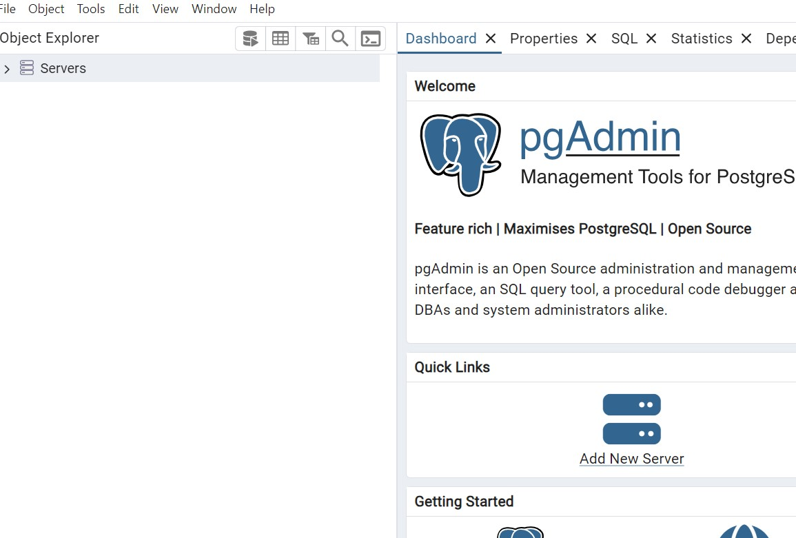
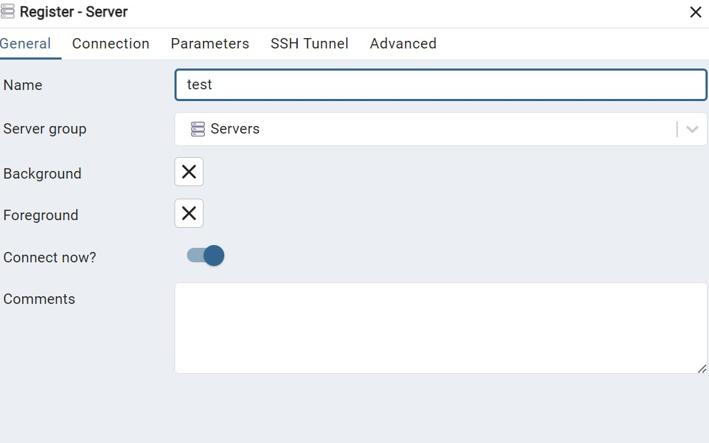
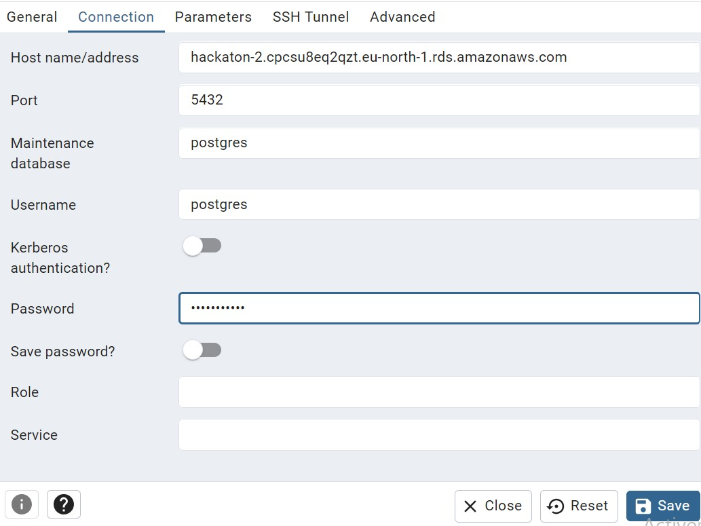
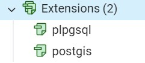

Database
========

L'application GeoAIVision est relié à une base de donnée postegre qui est loger sur le serveur d'Amazon (AWS)
A chaque fois qu'une nouvelle information est renseigné, les pushs se font vers cette base de donnée.

PgAdmin
-------
* Pour commencer ouvrir PgAdmin
.. image:: pgadmin.jpg
* Cliquer sur add serveur

* La page suivante s'ouvre et vous pouvez renseigner les informations de connexion

* Cliquez sur save

* Pour les données de type géographiques, postegres gère cela avec l'extension postgis. Le processus d'installation de l'extension est la suivante:

* La base hackaton_2024 a eté coder en sql et pour créer les tables polygones, zones, fusions, modifications, suppressions,créations,utilisateurs,divisions . 

Informations sur les tables
---------------------------

===============   ===========================================================================
zone                Les informations sur les données shapefiles et les rasters
===============   ===========================================================================
polygones                     Les informations sur les polygones
===============   ===========================================================================
===============   ===========================================================================
utilisateurs             Les informations sur les utilisateurs ou agent cartographe
===============   ===========================================================================
creations           La table qui contient les informations sur les nouveaux polygones crées
===============   ===========================================================================
===============   ===========================================================================
modifications      La table qui contient les informations sur les modifications de polygones 
===============   ===========================================================================
suppressions       La table qui contient les informations sur les suppressions de polygones 
===============   ===========================================================================
===============   ===========================================================================
fusions             La table qui contient les informations sur les fusions de polygones 
===============   ===========================================================================
divisions           La table qui contient les informations sur les divisions de  polygones 
===============   ===========================================================================

