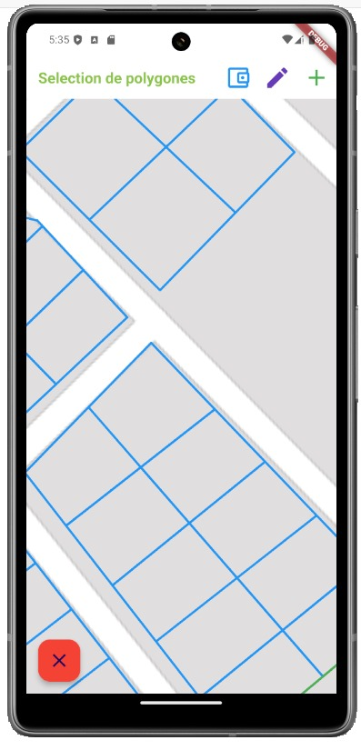
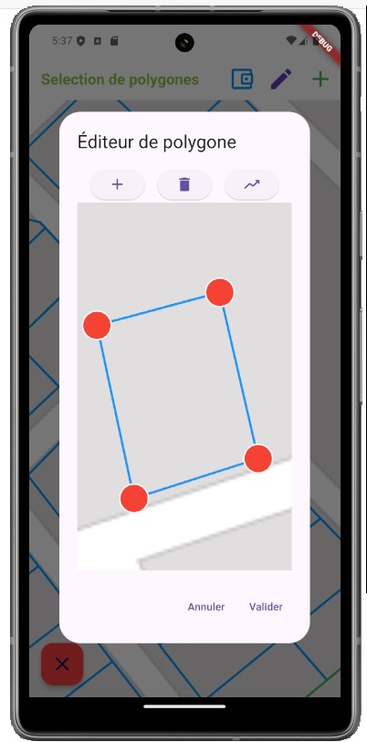
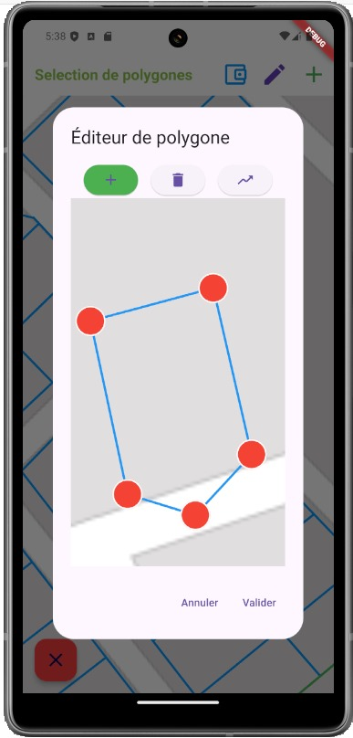

Selection
=========
L'interface de l'application se présente comme suit:

A gauche en bas le bouton *Sélectionner* permet de sélectionner un ou plusieurs polygones sur lesquels ont peut faire les manipulation possibles

.. danger::
    Si le bouton *Sélectioner* n'est pas appuyé aucune manipulation ne sera possible.

Les manipulations possibles sont les suivantes:

* Fusion : Pour fusionner deux ou plusieurs polygones
* modifier: Pour modifier les contours d'un polygone
* Suppression : Pour supprimer un polygone
* Création : Pour créer un nouveau polygone

* manipulations sont les suivantes
.. image:: a.jpg

.. image:: app.jpg  

